# Smoke Loader Analysis:

## Summary :
	Smoke loader is the most seen malware by researchers these days (the days of writing this analysis) 
	so I decided to investigate it and write a full analysis report on the obfuscation techniques that are used 
	by the malware in human explanation as this is the difference between human and automated analysis

	Note:
		This report is focused on the deobfuscation of the techniques used by the malware to evade detection
		starting from the first stage not focused on extracting its configuration
## Hunting :
Serving "malware bazaar" to find the trending malware of the day and found this 

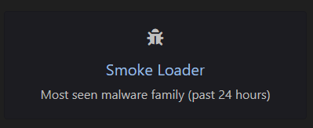

So let's analyze this sample to our analysis station...

## Basic file info :
	md5     5DC8820723E243E02B5CD81DBA7DD841]
	sha1    9F42928C91D59B4A92E705B47F88166FC518C644
	sha256  FA2EE4D575E27DCEB41AC10664C0F2ED94713FA1F78620963527047ED29E98ED

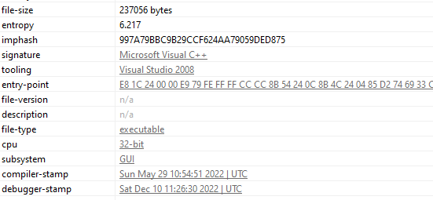

The entropy of the file is not that high.

After performing some behavioral analysis the behavior of the file was just exit silently without doing anything
So it's possible uses anti-VM technique so I quickly decided to end the behavioral analysis phase and start the advanced analysis phase static and dynamic as I prefer doing them Together not separately.

## Advanced analysis :

Starting analysis from the "winmain" I noticed a global variable that is used to decide the path of the file execution in a lot of places around the file which is "ubyte"

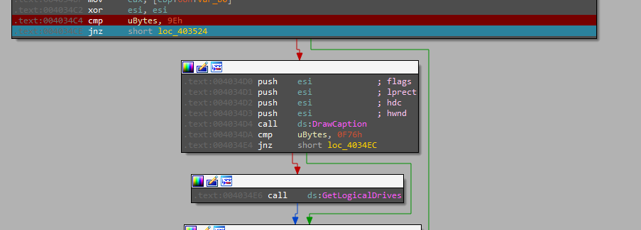

But because of the way they set it, there is a lot of code that will never be reachable because it's written to just two places around the file

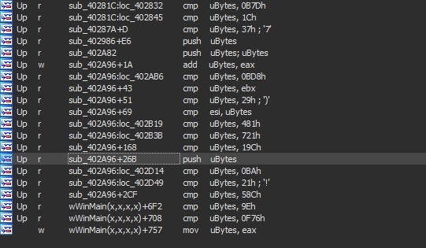

then there is also another repeated pattern where the file enters a very large loop and does one thing when the counter reaches a specific value and in the other counter values it just does useless things "I think it's just a ways to delay execution instead of using sleep"

This loop is 2382147352 times and reaches the seen APIs just when the counter is 126837 and continues doing compares with no goals

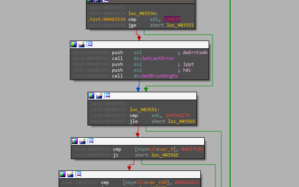

In the main function, it's just assigning a constant value to the "ubyte" and setting a specific error code then going into 
the function at the end 

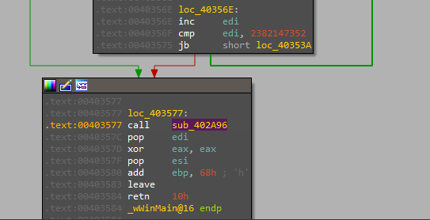

At the start of this function, there is another non-sense big loop for just adding another constant value to "ubyte" and then calling another function

This function is allocating memory with the size of "ubyte"

The next function contains another unreachable code and in the end, it writes a byte into an offset in the newly allocated memory so looping throw it will write some data into the allocated region.

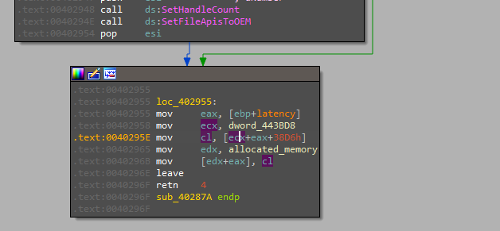

Then another many unreachable code and non-sense loop one of them is a useless call to "loadlibrary" as the argument passed to it is just "0"

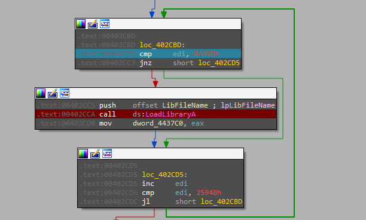

The next loop contains a call to a function that is used to resolve the "VirtualProtect" API to change the protection of the allocated memory with "PAGE_EXECUTE_READWRITE" protection.

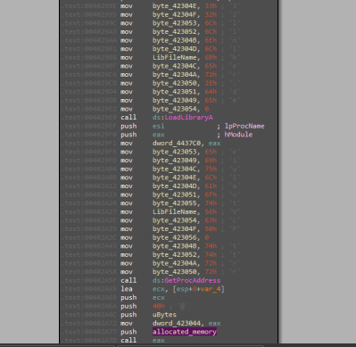

Now we have this.

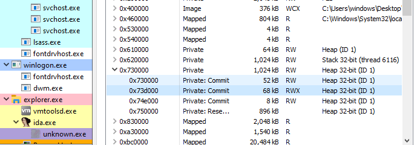

After that, by ignoring the unreachable code we will reach a call to a function that takes three arguments the allocated memory, its size, and a constant value.

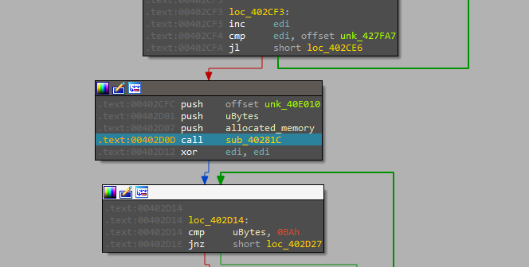

Going inside it we will notice a huge amount of mathematical operations (shifting, adding, XORing...) which will be a sign that this function is decrypting the payload that is written to the allocated memory and that the constant value passed may be the decryption key.

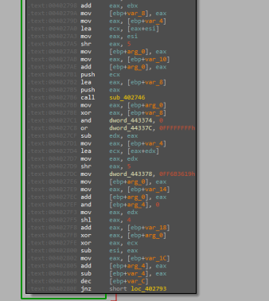

 After that, we will face another loop that has a function just adding a constant value to the pointer of the allocated memory which is the offset to the written data but also there is a call to the "Globalflag" API with a null pointer to throw an exception which is an anti-debugging technique.

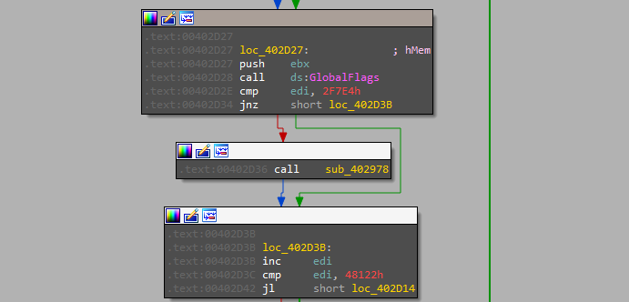

Now it's time to move the execution to the allocated memory

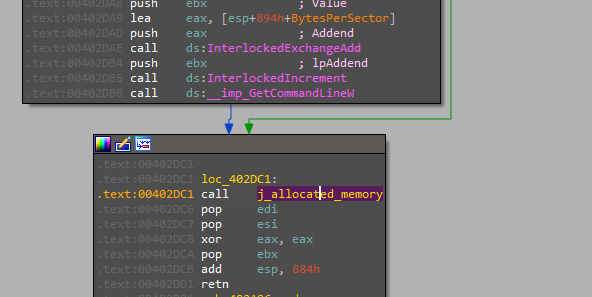

	note: IDA may not recognize it as code and treat it as data so you need to convert them to code "Press C"

Starting from there we will notice this pattern 

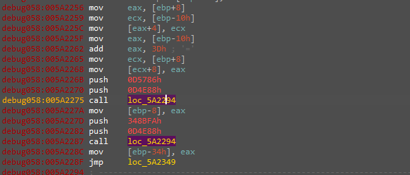

In the first look will get to your mind that this is resolving libraries base address throw hashing and this is right and the next few instructions are responsible for doing the lookup operation.

Then this code will start Getting the actual addresses of needed APIs in these libraries using the resolved "GetProcAddress" API

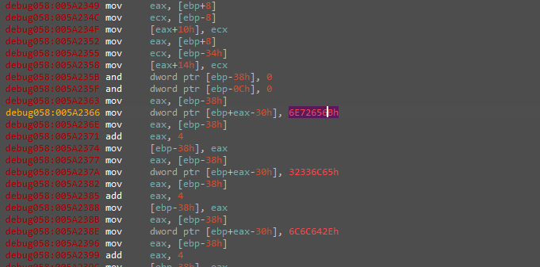

And having a look at the resolved functions we see those

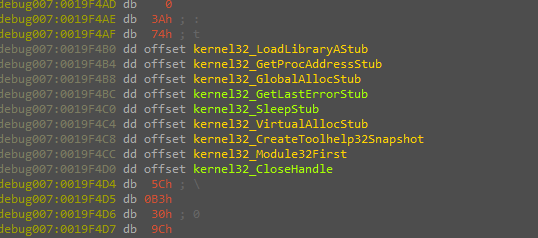

After that, the malware uses the resolved functions starting with "VirtualAlloc" to allocate memory with
"READ_WRIE_EXECUTE" permissions

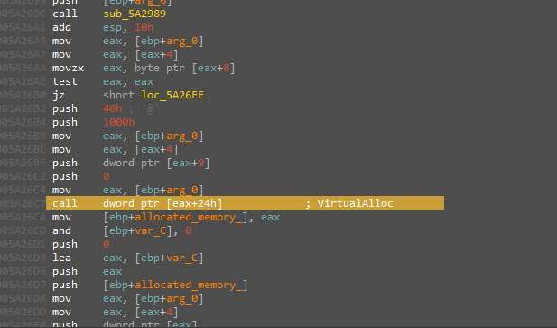

then another writing to the function in different places 

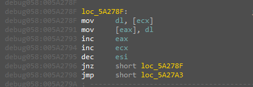

And execute the written data

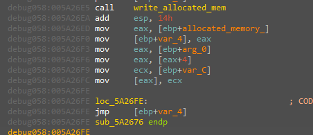
 
Another extracted file but they are starting in the same way by resolving the libraries with their hashes and resolving the APIs here is some of the resolved APIs

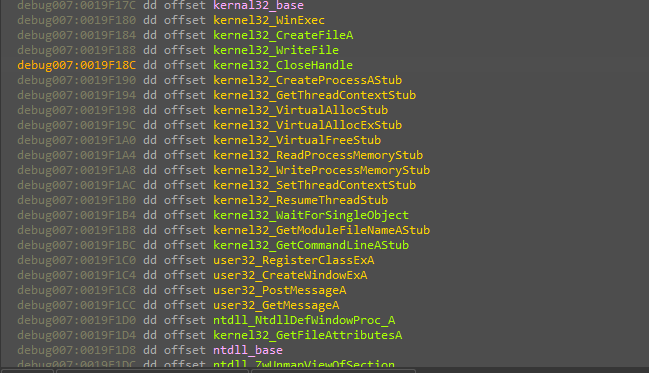

Seems interesting HAA,

Let us Continue with the flow we will find that the new instance is launched via the "CreateProccess" API in a suspended state.

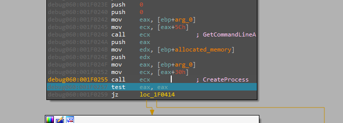

Writing data to it, then resuming its execution

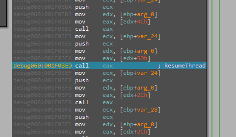

Stopping there, Now our way to the second stage is clear dumping it from the memory is the start of the next stage of analysis.

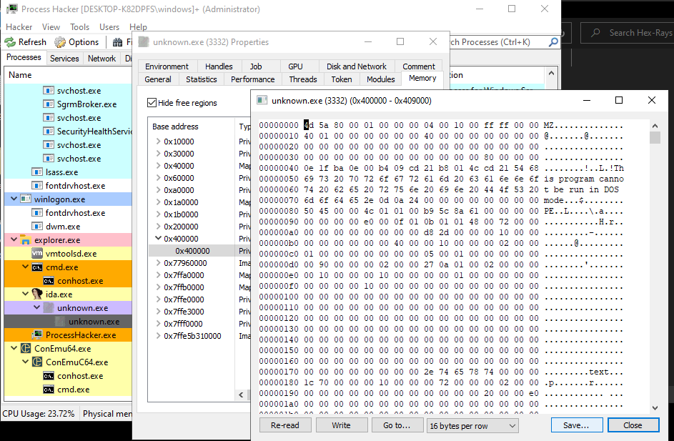

In this Stage there is a lot of fun happening there is a heavy anti-analysis going on here so let's start:

from the first look, there is a big welcome from the malware that you will notice which is starting with the use of 
"Opaque Predicates" is a technique used to fool the disassembler to assemble the file in the wrong way.
So you need to manually guide the assembler where to start assembling or write a script to replace the useless jumps used to do this kind of obfuscation.

## Second stage :
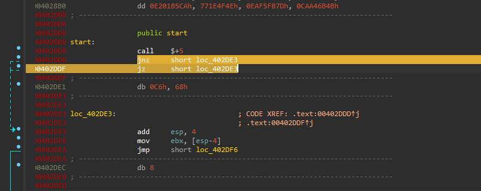

Following along with the code you will find it getting the BEP structure for checking if there is a debugger presented

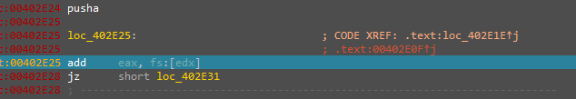

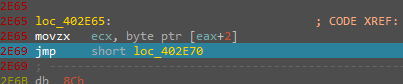

And another trick is that it uses these checks to calculate the jump address.

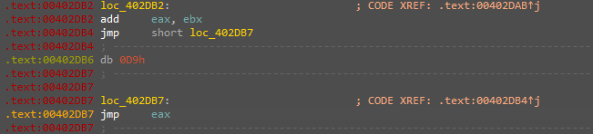

The next trick is that the code is self-modifying in the way that the function is not decrypted at run time but will only decrypted before its execution and then encrypt it back.
here we can see the decryption is just a simple xor with the first byte of the edx "FE"

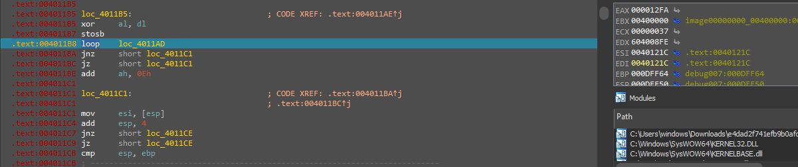

along with the decryption and the encryption of the functions and investigating each one you will find the function responsible for resolving the APIs using the hash.

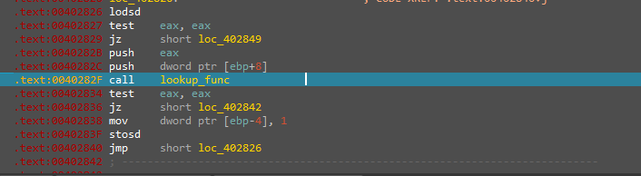

After that, the only Advanced trick left is using a custome copy of "ntdll.dll" to resolve its APIs so it can bypass the hooking from Security solutions and it's doing that in the same way of resolving the needed APIs then copying a new version of "ntdll.dll" for it self.

From this point, the rest of the analysis is very straightforward and following the same pattern it's just using the resolved APIs to check for hard-coded values that will indicate it's running inside VM and hard-coded process names to indicate it's being debugged.

	note:
		the rest of the analysis is repeatable actions which will make the report very self repeating here is the end

Here is a list of imported APIs after deobfuscation:

	ntdll.dll
	 	LdrLoadDll 
	 	NtClose 
		NtTerminateProcess 
		RtlInitUnicodeString 
		RtlMoveMemory 
		RtlZeroMemory 
		NtAllocateVirtualMemory 
		NtCreateSection 
		NtEnumerateKey 
		NtFreeVirtualMemory 
		NtMapViewOfSection 
		NtOpenKey 
		NtOpenProcess 
		NtQueryInformationProcess 
		NtQueryKey 
		NtQuerySystemInformation 
		NtUnmapViewOfSection 
		NtWriteVirtualMemory 
		RtlDecompressBuffer 
		towlower 
		wcsstr 
	kernel32.dll
		CopyFileW 
		CreateEventW 
		CreateFileMappingW 
		CreateThread 
		DeleteFileW 
		ExpandEnvironmentStringsW 
		GetModuleFileNameA 
		GetModuleFileNameW 
		GetModuleHandleA 
		GetSystemDirectoryA 
		GetTempFileNameW 
		GetTempPathW 
		GetVolumeInformationA 
		LocalAlloc 
		LocalFree 
		MapViewOfFile 
		Sleep 
		WaitForSingleObject 
		lstrcmpA 
		lstrcatW 
	user32.dll
		EnumChildWindows 
		EnumPropsA 
		GetForegroundWindow 
		GetKeyboardLayoutList 
		GetShellWindow 
		GetWindowThreadProcessId 
		SendMessageA 
		SendNotifyMessageA 
		SetPropA 
		wsprintfW 
	advapi32.dll
		GetTokenInformation 
		OpenProcessToken 
		shell32.dll

And here is a list of the processes to check if it's running:

	Autoruns.exe
	procexp.exe
	procexp64.exe
	procmon.exe
	procmon64.exe
	Tcpview.exe
	Wireshark.exe
	ProcessHacker.exe
	ollydbg.exe
	x32dbg.exe
	x64dbg.exe
	idaq64.exe
	idaw64.exe
	idaq.exe
	idaw.exe

